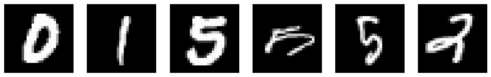
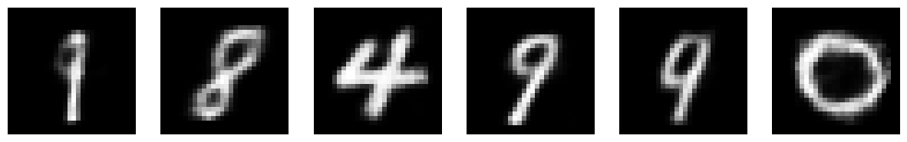

# VAE

VAE是一个数据生成模型, 可以用于生成和训练数据相似的数据. 本文将会依照论文[Auto-Encoding Variational Bayes](https://arxiv.org/abs/1312.6114)的思路, 推导VAE的原理, 并使用VAE生成MINST数据集中的手写数字图片.

MINST数据集中的原始图片如下:

使用VAE生成图片的流程如下:

代码实现以及注释在[VAE/main.ipynb](./VAE/main.ipynb)中.

## 背景知识

### KL散度

KL散度是衡量两个分布之间差异的度量。对于分布P和Q，KL散度定义为：

$$
D_{KL}(P||Q) = \int P(x) \log \frac{P(x)}{Q(x)} dx
$$

注意：
1. KL散度不满足对称性，即 $D_{KL}(P||Q) \neq D_{KL}(Q||P)$ 。
2. KL散度非负，即 $D_{KL}(P||Q) \geq 0$ 。
3. 当且仅当 $P=Q$ 时， $D_{KL}(P||Q)=0$ 。

## VAE推导

首先是问题定义，假设我们有一个数据集 $X = \{x^{(i)}\}_{i=1}^N$ , 这个数据集中的每个样本是独立同分布的。

假设这个数据集的每个样本是从一个随机过程中生成的，这个随机过程是这样的：
1. 首先从隐变量分布 $p_{\theta}(z)$ 中选择一个隐变量 $z^{(i)}$ ，我们假设这里的隐变量分布 $p_{\theta}(z)$ 是一个连续分布。
2. 然后根据隐变量 $z^{(i)}$ ，生成一个数据 $x^{(i)}$ ，这个数据 $x^{(i)}$ 服从一个条件分布 $p_{\theta}(x|z=z^{(i)})$ 。

理论上根据前面的假设，那么我们可以计算出数据集中每个样例出现的概率为 $p(x^{(i)}) = \int p_{\theta}(x^{(i)}|z) p_{\theta}(z) dz$ 。
如果这个公式中的每一项都有解析表达式(比如 $p_{\theta}(x^{(i)}|z)$ 是高斯分布， $p_{\theta}(z)$ 是均匀分布)，那么我们就可以通过极大似然估计来求解出模型参数 $\theta$ ，极大似然的目标函数为

$$
\theta^* = \arg \max_{\theta} \sum_{i=1}^N \log p_{\theta}(x^{(i)}) = \arg \max_{\theta} \sum_{i=1}^N \log \int p_{\theta}(x^{(i)}|z) p_{\theta}(z) dz
$$

> 为什么我们要求出模型的参数 $\theta$ 呢？因为求出 $\theta$ 后，我们就可以重复上面的随机过程，不断从 $p_{\theta}(z)$ 中采样隐变量 $\hat{z}$ , 然后从 $p_{\theta}(x|z=\hat{z})$ 采样出 $\hat{x}$ , 从而不断生成新的数据(比如图片)。

但是实际上没有这么完美，VAE要解决的问题是 $p(x^{(i)}) = \int p_{\theta}(x^{(i)}|z) p_{\theta}(z) dz$ 不可计算的情况，所以我们不能直接通过极大似然估计来求解出 $\theta$ 。

为此我们引入分布 $q_{\phi}(z|x)$ ，它是真实分布 $p_{\theta}(z|x)$ 的近似，表示在给定 $x$ 的情况下隐变量 $z$ 的分布。 **注意 $p_{\theta}(z|x)$ 是真实分布，但是我们不知道参数， $q_{\phi}(z|x)$ 是近似分布， 我们会使用机器学习去求解它的参数 $\phi$ 。**

> 在VAE中 $q_{\phi}(z|x)$ 扮演encoder的角色， $q_{\phi}(z|x)$ 将一个样例数据映射到一个隐变量的分布。而 $p_{\theta}(x|z)$ 扮演decoder的角色， $p_{\theta}(x|z)$ 将一个隐变量映射回样例数据。在实际代码中， $q_{\phi}(z|x)$ 和 $p_{\theta}(x|z)$ 都是神经网络。

根据上面的推导，既然 $q_{\phi}(z|x)$ 是真实分布 $p_{\theta}(z|x)$ 的近似，那么我们计算一下它们之间在第 $i$ 个样例数据 $x^{(i)}$ 上的KL散度：

$$
\begin{aligned}
D_{KL}(q_{\phi}(z|x^{(i)})||p_{\theta}(z|x^{(i)})) &= \int q_{\phi}(z|x^{(i)}) \log \frac{q_{\phi}(z|x^{(i)})}{p_{\theta}(z|x^{(i)})} dz \\
&= \int q_{\phi}(z|x^{(i)}) \log q_{\phi}(z|x^{(i)}) dz - \int q_{\phi}(z|x^{(i)}) \log p_{\theta}(z|x^{(i)}) dz \\
&= \int q_{\phi}(z|x^{(i)}) \log q_{\phi}(z|x^{(i)}) dz - \int q_{\phi}(z|x^{(i)}) \log \frac{p_{\theta}(z, x^{(i)})}{p_{\theta}(x^{(i)})} dz \\
&= \int q_{\phi}(z|x^{(i)}) \log q_{\phi}(z|x^{(i)}) dz - \int q_{\phi}(z|x^{(i)}) \log p_{\theta}(z, x^{(i)}) dz + \int q_{\phi}(z|x^{(i)}) \log p_{\theta}(x^{(i)}) dz \\
&= \int q_{\phi}(z|x^{(i)}) \log q_{\phi}(z|x^{(i)}) dz - \int q_{\phi}(z|x^{(i)}) \log p_{\theta}(z, x^{(i)}) dz + \log p_{\theta}(x^{(i)}) \\
&= \int q_{\phi}(z|x^{(i)}) \log \frac{q_{\phi}(z|x^{(i)})}{p_{\theta}(z, x^{(i)})} dz + \log p_{\theta}(x^{(i)}) \\

\text{移项可得：} \\
\log p_{\theta}(x^{(i)}) &= D_{KL}(q_{\phi}(z|x^{(i)})||p_{\theta}(z|x^{(i)})) - \int q_{\phi}(z|x^{(i)}) \log \frac{q_{\phi}(z|x^{(i)})}{p_{\theta}(z, x^{(i)})} dz \\
&= D_{KL}(q_{\phi}(z|x^{(i)})||p_{\theta}(z|x^{(i)})) + \int q_{\phi}(z|x^{(i)}) \log \frac{p_{\theta}(z, x^{(i)})}{q_{\phi}(z|x^{(i)})} dz \\
&= D_{KL}(q_{\phi}(z|x^{(i)})||p_{\theta}(z|x^{(i)})) + \mathcal{L}(\theta, \phi; x^{(i)}) \\

\text{其中：} \\
\mathcal{L}(\theta, \phi; x^{(i)}) &= \int q_{\phi}(z|x^{(i)}) \log \frac{p_{\theta}(z, x^{(i)})}{q_{\phi}(z|x^{(i)})} dz \\
&= \mathbb{E}_{z \sim q_{\phi}(z|x^{(i)})} [\log p_{\theta}(z, x^{(i)}) - \log q_{\phi}(z|x^{(i)})]

\end{aligned}
$$

其中 $\mathbb{E}_{z \sim q_{\phi}(z|x^{(i)})} [\log p_{\theta}(z, x^{(i)}) - \log q_{\phi}(z|x^{(i)})]$ 的意思是 $z$ 从 $q_{\phi}(z|x^{(i)})$ 分布中采样，然后计算 $\log p_{\theta}(z, x^{(i)}) - \log q_{\phi}(z|x^{(i)})$ 的期望。

注意到上面公式中 $\log p_{\theta}(x^{(i)})$ 分解成了两部分 $D_{KL} + \mathcal{L}$ ，而由于KL散度非负，所以 $\mathcal{L}$ 是 $\log p_{\theta}(x^{(i)})$ 的下界:

$$
\log p_{\theta}(x^{(i)}) \geq \mathcal{L}(\theta, \phi; x^{(i)})
$$

**而我们原本的目标是要最大化 $\sum_{i=1}^N \log p_{\theta}(x^{(i)})$ ，所以现在我们可以将目标转换为最大化 $\sum_{i=1}^N \mathcal{L}(\theta, \phi; x^{(i)})$ ，这里的 $\mathcal{L}(\theta, \phi; x^{(i)})$ 就是我们常说的ELBO(Evidence Lower Bound)。**

到此我们已经推导出了VAE原论文中的公式(1)和(2)。

我们继续来看看 $\mathcal{L}(\theta, \phi; x^{(i)})$ ，这个公式可以进一步分解为：

$$
\begin{aligned}
\mathcal{L}(\theta, \phi; x^{(i)}) &= \int q_{\phi}(z|x^{(i)}) \log \frac{p_{\theta}(z, x^{(i)})}{q_{\phi}(z|x^{(i)})} dz \\
&= \int q_{\phi}(z|x^{(i)}) \log \frac{p_{\theta}(x^{(i)}|z) p_{\theta}(z)}{q_{\phi}(z|x^{(i)})} dz \\
&= \int q_{\phi}(z|x^{(i)}) \log \frac{p_{\theta}(z)}{q_{\phi}(z|x^{(i)})} dz + \int q_{\phi}(z|x^{(i)}) \log p_{\theta}(x^{(i)}|z) dz \\
&= -D_{KL}(q_{\phi}(z|x^{(i)})||p_{\theta}(z)) + \int q_{\phi}(z|x^{(i)}) \log p_{\theta}(x^{(i)}|z) dz \\
&= -D_{KL}(q_{\phi}(z|x^{(i)})||p_{\theta}(z)) + \mathbb{E}_{z \sim q_{\phi}(z|x^{(i)})} \log p_{\theta}(x^{(i)}|z) \\
\end{aligned}
$$

这里对应VAE原论文中的公式(3)。

## 最大化ELBO

现在我们暂时从VAE的推导中抽离出来，来看看如何最大化一个含有参数 $\alpha$ 的期望表达式 $\mathbb{E}_{x \sim p(x)} [f(x)]$ ，直观的想法是求 $\mathbb{E}_{x \sim p(x)} [f(x)]$ 对 $\alpha$ 的梯度，然后更新 $\alpha$ 。

情况一： $p(x)$ 不含 $\alpha$ ，只有 $f(x)$ 含有 $\alpha$ ，那么我们可以直接求梯度：

$$
\nabla_{\alpha} \mathbb{E}_{x \sim p(x)} [f(x)] = \nabla_{\alpha} \int f(x) p(x) dx = \int \nabla_{\alpha} f(x) p(x) dx = \mathbb{E}_{x \sim p(x)} [\nabla_{\alpha} f(x)]
$$

即：期望的导数等于导数的期望。

情况二： $p(x)$ 和 $f(x)$ 都含有 $\alpha$ ，这种情况下会稍微复杂一些：

$$
\begin{aligned}
\nabla_{\alpha} \mathbb{E}_{x \sim p(x)} [f(x)] &= \nabla_{\alpha} \int f(x) p(x) dx \\
&= \int [\nabla_{\alpha} f(x) + f(x) \nabla_{\alpha} \log p(x)] p(x) dx \\
&= \mathbb{E}_{x \sim p(x)} [\nabla_{\alpha} f(x) + f(x) \nabla_{\alpha} \log p(x)]
\end{aligned}
$$

还有一种情况三, 就是 $p(x)$ 含有 $\alpha$ ， $f(x)$ 不含有 $\alpha$ ，这种情况下将情况二的公式中的 $\nabla_{\alpha} f(x)$ 替换为 $0$ 即可, 这里不列出详细的公式了.

现在我们尝试对 $\mathcal{L}(\theta, \phi; x^{(i)})$ 的第二项 $\mathbb{E}_{z \sim q_{\phi}(z|x^{(i)})} \log p_{\theta}(x^{(i)}|z)$ 求关于参数 $\phi$ 的梯度，也就是上面情况三的场景，为了方便，在后面的推导中我们使用 $f(z)$ 代指 $\log p_{\theta}(x^{(i)}|z)$ ：

$$
\nabla_{\phi} \mathbb{E}_{z \sim q_{\phi}(z|x^{(i)})} f(z) = \mathbb{E}_{z \sim q_{\phi}(z|x^{(i)})} f(z) \nabla_{\phi} \log q_{\phi}(z|x^{(i)})
$$

论文中提到，直接使用蒙特卡洛的方法对该梯度进行估计具有很大的方差，并不可行。

**要解决这个问题，论文中提出了重参数化技巧。** 思考一下期望 $\mathbb{E}_{z \sim q_{\phi}(z|x^{(i)})} f(z)$ 的计算过程，首先要使用参数 $\phi$ 生成分布 $q_{\phi}(z|x^{(i)})$ ，然后从这个分布中采样 $z$ ，用采样到的 $z$ 计算 $f(z)$ ，最后再取平均。**重参数化技巧的核心是将参数 $\phi$ 的介入过程延迟到采样 $z$ 之后，使得采样之前的过程不依赖 $\phi$ ，这样的话我们就能够将对期望的求导变成情况一的简单情况。**

要实现这个操作，我们需要**构造**一个分布 $p(\epsilon)$ 和一个依赖参数 $\phi, \epsilon, x^{(i)}$ 的函数 $g_{\phi}(\epsilon, x^{(i)})$ ，使得：

$$
\mathbb{E}_{z \sim q_{\phi}(z|x^{(i)})} [f(z)] = \mathbb{E}_{\epsilon \sim p(\epsilon)} [f(g_{\phi}(\epsilon, x^{(i)}))]
$$

> 这个部分搭配论文2.4章节的例子会更好理解，原论文放得太远了：
> 假设 $q_{\phi}(z|x^{(i)})$ 是高斯分布，也就是说使用参数 $\phi$ ，对于输入 $x^{(i)}$ 会计算出一个高斯分布的均值 $\mu$ 和方差 $\sigma^2$ ，原来的计算逻辑是从 $\mathcal{N}(\mu, \sigma^2)$ 中采样 $z$ ，然后计算 $f(z)$ 的平均值。
> 现在，我们引入一个标准正态分布 $p(\epsilon) = \mathcal{N}(0, 1)$ ，从这个分布中采样 $\epsilon$ ，然后根据 $z = \mu + \sigma \epsilon$ 计算出 $z$ ，最后计算 $f(z)$ 的平均值，可以证明这样算出来的期望和前一种算法的结果是一样的。
> 注意原本我们用 $\phi$ 计算出 $\mu$ 和 $\sigma$ 之后，是需要从 $\mathcal{N}(\mu, \sigma^2)$ 中采样，但是现在我们只是用 $\mu$ 和 $\sigma$ 参与一个表达式计算出 $z$ ，采样被移动到和参数 $\phi$ 无关的部分了。

现在，使用蒙特卡洛算法，我们可以这样计算期望：

$$
\mathbb{E}_{z \sim q_{\phi}(z|x^{(i)})} [f(z)] = \mathbb{E}_{\epsilon \sim p(\epsilon)} [f(g_{\phi}(\epsilon, x^{(i)}))] \simeq \frac{1}{L} \sum_{l=1}^L f(g_{\phi}(\epsilon^{(l)}, x^{(i)})) \text{其中} \epsilon^{(l)} \sim p(\epsilon)
$$

> 论文中写蒙特卡洛算法显得比较高大上, 但是这里其实就是随机采样 $L$ 次, 然后用来估计 $f(g_{\phi}(\epsilon^{(l)}, x^{(i)}))$ 的值.

现在让我们回到 $\mathcal{L}(\theta, \phi; x^{(i)})$ 的计算公式，前面我们已经推导出 $\mathcal{L}(\theta, \phi; x^{(i)})$ 有两种形式，那么将这个重参数化技巧分别带入这两个公式，我们就可以得到两个新的公式。

$\mathcal{L}(\theta, \phi; x^{(i)})$ 的第一个公式：

$$
\mathcal{L}(\theta, \phi; x^{(i)}) = \mathbb{E}_{z \sim q_{\phi}(z|x^{(i)})} [\log p_{\theta}(z, x^{(i)}) - \log q_{\phi}(z|x^{(i)})]
$$

带入重参数化技巧之后：

$$
\begin{aligned}
\tilde{\mathcal{L}}^A(\theta, \phi; x^{(i)}) &= \mathbb{E}_{\epsilon \sim p(\epsilon)} [\log p_{\theta}(g_{\phi}(\epsilon, x^{(i)}), x^{(i)}) - \log q_{\phi}(g_{\phi}(\epsilon, x^{(i)})|x^{(i)})] \\
&= \frac{1}{L} \sum_{l=1}^L [\log p_{\theta}(z^{(i,l)}, x^{(i)}) - \log q_{\phi}(z^{(i,l)}|x^{(i)})] \\
\text{其中} z^{(i,l)} &= g_{\phi}(\epsilon^{(l)}, x^{(i)}), \epsilon^{(l)} \sim p(\epsilon)
\end{aligned}
$$

$\mathcal{L}(\theta, \phi; x^{(i)})$ 的第二个公式：

$$
\mathcal{L}(\theta, \phi; x^{(i)}) = -D_{KL}(q_{\phi}(z|x^{(i)})||p_{\theta}(z)) + \mathbb{E}_{z \sim q_{\phi}(z|x^{(i)})} \log p_{\theta}(x^{(i)}|z)
$$

带入重参数化技巧之后：

$$
\begin{aligned}
\tilde{\mathcal{L}}^B(\theta, \phi; x^{(i)}) &= -D_{KL}(q_{\phi}(z|x^{(i)})||p_{\theta}(z)) + \mathbb{E}_{\epsilon \sim p(\epsilon)} \log p_{\theta}(x^{(i)}|g_{\phi}(\epsilon, x^{(i)})) \\
&= -D_{KL}(q_{\phi}(z|x^{(i)})||p_{\theta}(z)) + \frac{1}{L} \sum_{l=1}^L \log p_{\theta}(x^{(i)}|z^{(i,l)}) \\
\text{其中} z^{(i,l)} &= g_{\phi}(\epsilon^{(l)}, x^{(i)}), \epsilon^{(l)} \sim p(\epsilon)
\end{aligned}
$$

借助这两个公式，我们都可以使用蒙特卡洛采样来估计 $\mathcal{L}(\theta, \phi; x^{(i)})$ 以及它对参数 $\theta$ 和 $\phi$ 的梯度。这两个公式的区别在于前者不需要直接计算KL散度，而后者需要。也正因为后者是直接计算KL散度而不是估计，因此后者计算出的梯度方差更小。

> 比如我们规定 $q_{\phi}(z|x^{(i)})$ 和 $p_{\theta}(z)$ 都是高斯分布，那么我们就可以直接计算KL散度和梯度。

最后，如果我们要计算包含 $N$ 个样例数据的数据集 $X = \{x^{(i)}\}_{i=1}^N$ 的 $\mathcal{L}(\theta, \phi; x^{(i)})$ ，那么我们可以从中采样出 $M$ 个样例数据进行估计：

$$
\mathcal{L}(\theta, \phi; X) = \frac{N}{M} \sum_{i=1}^M \tilde{\mathcal{L}}(\theta, \phi; x^{(i)})
$$

> 这里实际的意思是, 我们可以从样例数据中随机采样一个batch来估计 $\mathcal{L}(\theta, \phi; X)$ 并且对它进行调优, 实际上是深度学习中很常用的一个技巧, 不过论文为了显得严谨, 啥都要列公式证明一下。

其中的 $\tilde{\mathcal{L}}$ 根据是否可以直接计算KL散度而选择使用 $\tilde{\mathcal{L}}^A$ 或 $\tilde{\mathcal{L}}^B$ 。

此外，如果我们采样的数据量 $M$ 足够大，那么对于每个数据点的估计次数 $L$ 可以直接设为 $1$ ，也就是说可以通过采样更多样例数据来减少对单个样例数据的估计次数。

## 示例：在MINST数据集上训练VAE

代码实现以及注释在[VAE/main.ipynb](./VAE/main.ipynb)中.

MINST是著名的手写字识别数据集，数据集中的每个样例数据是一个28x28的灰度图，每个像素的取值范围是0到255。
**这里我们为了方便处理，将每个像素除以255变成0到1之间的值。并且在之后的模型中会将每张图片处理成一个784维的一维向量。**

我们在MINST数据集上训练VAE会训练一个从图片到隐变量的encoder $q_{\phi}(z|x)$ ，以及一个从隐变量到图片的decoder $p_{\theta}(x|z)$ 。有了这个decoder之后，我们就可以构造新的隐变量，然后使用decoder生成和MINST数据集类似的图片。**因此本任务中并不会使用MINIST数据集的label。**

训练VAE之前，首先我们需要做一些约定：
1. 约定隐变量 $z$ 的维度为 $J$ ，即 $z \in \mathbb{R}^J$ 。并且隐变量 $z$ 的分布 $p_{\theta}(z)$ 是一个 $J$ 维相互独立，均值为0方差为1的高斯分布，即 $p_{\theta}(z) = \mathcal{N}(0, I)$ 。这个分布中并没有需要学习的参数，因此也可以直接写成 $p(z) = \mathcal{N}(0, I)$ 。
2. 对于encoder $q_{\phi}(z|x)$ ，我们使用一个简单的两层神经网络来近似(一层全连接+激活函数+一层全连接)。我们约定 $q_{\phi}(z|x)$ 也是一个高斯分布，因此encoder对于每张输入的图片会输出两个 $J$ 维的向量，分别表示均值 $\mu$ 和方差 $\sigma^2$ ，描述一个高斯分布 $\mathcal{N}(\mu, \sigma^2 I)$ ，不同维度之间相互独立。
3. 对于decoder $p_{\theta}(x|z)$ ，我们同样使用一个简单的两层神经网络来近似(一层全连接+激活函数+一层全连接+sigmoid)。最后的sigmoid激活函数保证了输出值在0到1之间，因此decoder输出的是一个784维的向量，表示每个像素是白色的概率。

由于 $p(z)$ 和 $q_{\phi}(z|x)$ 都是高斯分布，我们可以直接计算出 $D_{KL}$ 的解析表达式，因此这里我们使用 $\tilde{\mathcal{L}}^B$ 来计算 $\mathcal{L}(\theta, \phi; x^{(i)})$ ：

$$
\begin{aligned}
\tilde{\mathcal{L}}^B(\theta, \phi; x^{(i)}) &= -D_{KL}(q_{\phi}(z|x^{(i)})||p(z)) + \frac{1}{L} \sum_{l=1}^L \log p_{\theta}(x^{(i)}|z^{(i,l)}) \\
&= \frac{1}{2} \sum_{j=1}^J \left(1 + \log \sigma^{(i,j)^2} - \mu^{(i,j)^2} - \sigma^{(i,j)^2} \right) + \frac{1}{L} \sum_{l=1}^L \log p_{\theta}(x^{(i)}|z^{(i,l)}) \\
\text{其中} z^{(i,l)} &= \mu^{(i)} + \sigma^{(i)} \odot \epsilon^{(l)}, \epsilon^{(l)} \sim \mathcal{N}(0, I)
\end{aligned}
$$

此外在代码中还有一些细节, 比如重参数化的代码实现, 比如由于 $\sigma^2$ 不能为负, 所以encoder实际上输出的不是 $\sigma^2$ 而是 $\log \sigma^2$ , 更多细节可以自行阅读[代码](./VAE/main.ipynb).
